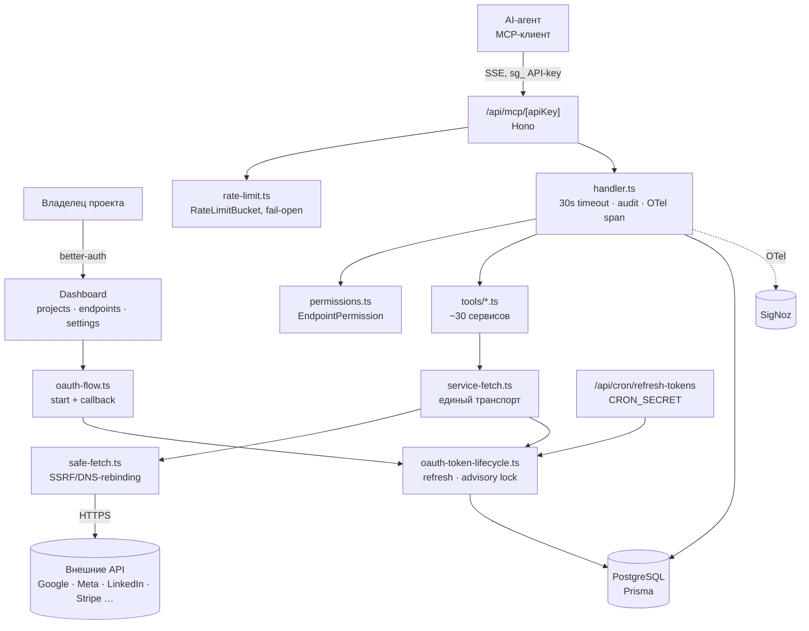

# Архитектура ScopeGate

Стек: Next.js 16 (App Router) · Prisma 7 + PostgreSQL · better-auth · MCP-сервер на Hono · OTel → SigNoz · деплой Coolify (Docker, `node:22-slim`, standalone).

## Карта системы

## Ключевые узлы

| Узел | Файл | Роль |
|---|---|---|
| Реестр провайдеров | `src/lib/provider-registry.ts` | Единственный источник правды: транспорт, стратегия токена, retry, права. Добавление провайдера — правка только здесь |
| Транспорт | `src/lib/mcp/service-fetch.ts` | Токен + base URL + заголовки + SSRF + OTel CLIENT-спан |
| Жизненный цикл токена | `src/lib/mcp/../oauth-token-lifecycle.ts` | Refresh для всех провайдеров, `OAuthTokenError`, классификация permanent/transient |
| Исполнение инструмента | `src/lib/mcp/handler.ts` | Права, 30s таймаут, аудит, спан `mcp.tool <name>` |
| Права | `src/lib/mcp/permissions.ts` | `PERMISSION_GROUPS` выводятся из реестра |

## Решения

| ID | Решение | Почему | Как проверить |
|---|---|---|---|
| D-0001 | Единый реестр провайдеров вместо конфигов в каждом tools/*.ts | 26+ провайдеров, дублирование транспорта и прав расползалось | `TRANSPORT_CONFIGS`/`PERMISSION_GROUPS` выводятся из `PROVIDER_REGISTRY`; новый провайдер не требует правок в других файлах |
| D-0002 | Свой `safe-fetch` на `node:https` вместо `fetch()` | Защита от SSRF и DNS-rebinding: проверяются ВСЕ A/AAAA-записи до соединения | Ни один tools/*.ts не вызывает голый `fetch` к внешнему API |
| D-0003 | Refresh токена сериализуется через `pg_advisory_xact_lock` | Одноразовые refresh-токены (Google, Twitter): гонка двух обновлений давала ложный revoke | Параллельные вызовы схлопываются в один сетевой refresh |
| D-0004 | Счётчик `consecutiveFailures` (порог 3) перед revoke | Одна сетевая ошибка не должна убивать живой токен | Transient-ошибка инкрементирует счётчик; revoke только на 3-й |
| D-0005 | Токены сервисов шифруются AES-256-GCM ключом `BETTER_AUTH_SECRET`, лежат в БД | Секреты не должны жить в env и не должны читаться из дампа как есть | `ServiceConnection.accessToken` в БД нечитаем без ключа |
| D-0006 | Rate-limit fail-open | Сбой БД не должен ронять весь MCP-эндпоинт | Ошибка `checkRateLimit()` логируется как `mcp.rate_limit_error`, запрос проходит |
| D-0007 | Публичная регистрация выключена (`disableSignUp`), вход только по инвайту | Гейт закрытой беты | `POST /api/auth/sign-up/email` возвращает ошибку |
| D-0008 | Миграции применяются при старте контейнера, не при сборке | Сборка не требует живой БД | `docker-entrypoint.sh` → `migrate deploy` из `/prisma-runtime/` |
| D-0009 | CSP в режиме Report-Only, отчёты → свой эндпоинт → SigNoz | Сначала собрать реальные нарушения, потом включать enforcement | Заголовок `Content-Security-Policy-Report-Only`, спаны из `/api/csp-report` |
