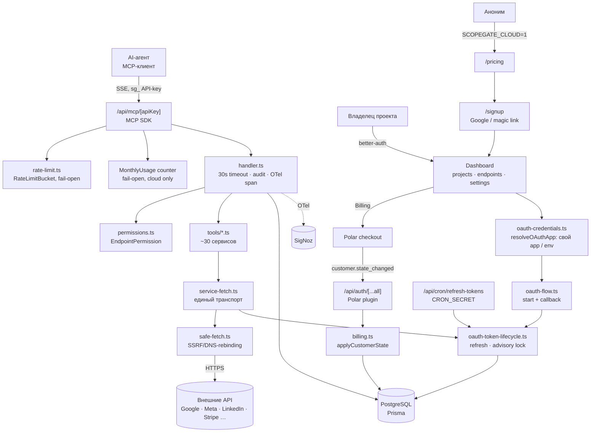

# Архитектура ScopeGate

Стек: Next.js 16 (App Router) · Prisma 7 + PostgreSQL · better-auth · MCP-сервер на MCP SDK Streamable HTTP · OTel → SigNoz · деплой Coolify (Docker, `node:22-slim`, standalone).

## Карта системы

`isCloud()` (`SCOPEGATE_CLOUD=1`) — единственный переключатель между самохостом и облаком; ветка Landing → Signup → Checkout существует только в облаке, роуты гейтятся `notFound()` на уровне страниц.

## Ключевые узлы

| Узел | Файл | Роль |
|---|---|---|
| Реестр провайдеров | `src/lib/provider-registry.ts` | Единственный источник правды: транспорт, стратегия токена, retry, права. Добавление провайдера — правка только здесь |
| Транспорт | `src/lib/mcp/service-fetch.ts` | Токен + base URL + заголовки + SSRF + OTel CLIENT-спан |
| Жизненный цикл токена | `src/lib/mcp/../oauth-token-lifecycle.ts` | Refresh для всех провайдеров, `OAuthTokenError`, классификация permanent/transient |
| Исполнение инструмента | `src/lib/mcp/handler.ts` | Права, 30s таймаут, аудит, спан `mcp.tool <name>` |
| Права | `src/lib/mcp/permissions.ts` | `PERMISSION_GROUPS` выводятся из реестра |
| Cloud/self-host переключатель | `src/lib/cloud.ts` | `isCloud()` — функция, не константа, читает `SCOPEGATE_CLOUD` на каждый вызов; серверный, страницы гейтят себя `notFound()` |
| Планы и биллинг | `src/lib/plans.ts`, `src/lib/billing.ts` | `PLAN_REGISTRY` — планы и лимиты в коде, не в БД; `applyCustomerState()` идемпотентно проецирует Polar-событие `customer.state_changed` на `User`; Polar смонтирован внутри `/api/auth/[...all]` (`@polar-sh/better-auth`) — отдельных `/api/billing/*` роутов нет |
| BYO OAuth-креды | `src/lib/oauth-credentials.ts` | `resolveOAuthApp(provider, projectId)` — своя запись `ProviderCredential` по credential-группе (`getCredentialGroup()`), иначе env-переменные оператора; в облаке `groupRequiresOwnApp()` требует свой app для всех OAuth-групп без исключений (`docs/byo-credentials.md`) |

## Решения

| ID | Решение | Почему | Как проверить |
|---|---|---|---|
| D-0001 | Единый реестр провайдеров вместо конфигов в каждом tools/*.ts | 26+ провайдеров, дублирование транспорта и прав расползалось | `TRANSPORT_CONFIGS`/`PERMISSION_GROUPS` выводятся из `PROVIDER_REGISTRY`; новый провайдер не требует правок в других файлах |
| D-0002 | Свой `safe-fetch` на `node:https` вместо `fetch()` | Защита от SSRF и DNS-rebinding: проверяются ВСЕ A/AAAA-записи до соединения | Ни один tools/*.ts не вызывает голый `fetch` к внешнему API |
| D-0003 | Refresh токена сериализуется через `pg_advisory_xact_lock` | Одноразовые refresh-токены (Google, Twitter): гонка двух обновлений давала ложный revoke | Параллельные вызовы схлопываются в один сетевой refresh |
| D-0004 | Счётчик `consecutiveFailures` (порог 3) перед revoke | Одна сетевая ошибка не должна убивать живой токен | Transient-ошибка инкрементирует счётчик; revoke только на 3-й |
| D-0005 | Токены сервисов шифруются AES-256-GCM ключом `BETTER_AUTH_SECRET`, лежат в БД | Секреты не должны жить в env и не должны читаться из дампа как есть | `ServiceConnection.accessToken` в БД нечитаем без ключа |
| D-0006 | Rate-limit fail-open | Сбой БД не должен ронять весь MCP-эндпоинт | Ошибка `checkRateLimit()` логируется как `mcp.rate_limit_error`, запрос проходит |
| D-0007 | ~~Публичная регистрация выключена (`disableSignUp`), вход только по инвайту~~ — **уточнено D-0012** | Гейт закрытой беты | `POST /api/auth/sign-up/email` возвращает ошибку в обоих режимах |
| D-0008 | Миграции применяются при старте контейнера, не при сборке | Сборка не требует живой БД | `docker-entrypoint.sh` → `migrate deploy` из `/prisma-runtime/` |
| D-0009 | CSP в режиме Report-Only, отчёты → свой эндпоинт → SigNoz | Сначала собрать реальные нарушения, потом включать enforcement | Заголовок `Content-Security-Policy-Report-Only`, спаны из `/api/csp-report` |
| D-0010 | Одна кодовая база, два деплоя, переключаются `SCOPEGATE_CLOUD` | Cloud и self-host расходятся только в env, не в форке репозитория | `isCloud()` — единственная точка чтения; не `NEXT_PUBLIC_*`, т.к. один образ идёт в оба деплоя |
| D-0011 | Планы и лимиты живут в коде (`PLAN_REGISTRY`), не в БД | Лимиты версионируются вместе с кодом, а не дрейфуют в отдельной таблице; маркетинговая страница цен и энфорсмент читают один файл | `src/lib/plans.ts` не импортирует `db`; `assertWithinLimit()` — единственная точка энфорсмента (создание проекта, создание endpoint'а, месячный счётчик MCP) |
| D-0012 | Пароль-регистрация закрыта везде (наследует D-0007); в облаке пользователь заводится сам — через Google (`GOOGLE_SIGNIN_CLIENT_ID`, отдельный OAuth-клиент от сервисного) или magic link, self-host остаётся инвайт-онли | Публичный self-serve нужен для облачного продукта, но password-регистрация — вектор спама в обоих режимах | `/signup` доступен только при `isCloud()`; `disableSignUp: true` в `auth.ts` не снимается ни в одном режиме |
| D-0013 | В облаке каждый проект использует своё OAuth-приложение (BYO-креды), self-host — опционально | Google CASA-аудит, Meta App Review, LinkedIn партнёрка ограничивают общее приложение 100 пользователями и еженедельно истекающими токенами; в облаке общий app вообще не используется | `resolveOAuthApp()` → `groupRequiresOwnApp()` требует `ProviderCredential` для любой OAuth-группы, когда `isCloud()`; self-host падает обратно на env-переменные оператора (`docs/byo-credentials.md`) |
