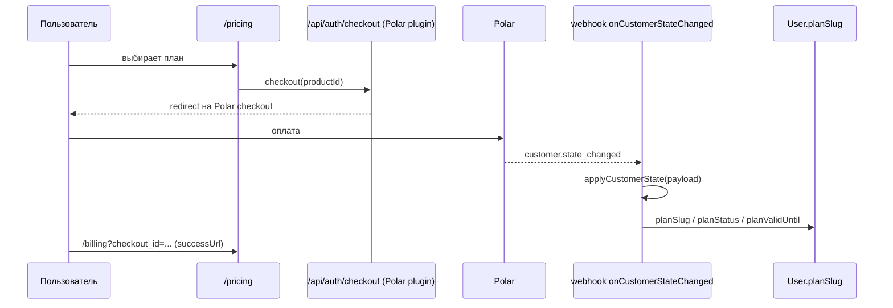

# Поток: покупка плана и лимиты

Только в облаке (`SCOPEGATE_CLOUD=1`); в self-host весь этот поток — no-op, лимиты не считаются и не проверяются. Биллинг — плагин `@polar-sh/better-auth`, примонтированный внутри общего `/api/auth/[...all]` — отдельных `/api/billing/*` роутов нет.

## Опорные точки

| Шаг | Файл |
|---|---|
| Определения планов и лимитов | `src/lib/plans.ts` (`PLAN_REGISTRY`) — источник и для `/pricing`, и для enforcement, чтобы цифры не разъезжались |
| Product id → план | `getPolarProductId` / `getPlanForProductId` — через env-переменную (`polarProductIdEnv`), sandbox/production id не в коде |
| Checkout/portal/webhook | `src/lib/auth.ts` → `polarPlugin()`, подключается только если заданы `POLAR_ACCESS_TOKEN` + `POLAR_WEBHOOK_SECRET` |
| Применение состояния | `src/lib/billing.ts` → `applyCustomerState()` |
| Привязка Polar-клиента к юзеру | `createCustomerOnSignUp: true` — `externalId` Polar-клиента = id пользователя ScopeGate |

## `customer.state_changed` — единственное обрабатываемое событие

Несёт полный текущий срез (все активные подписки), а не дельту — поэтому обработчик идемпотентен: повтор или доставка вне очереди сходятся к одному и тому же результату без дедупликации по event id. Если активных подписок, маппящихся на известный план, несколько, побеждает самая дорогая (`priceMonthly` по убыванию) — детерминированно, не по порядку массива. Нет подписки/нет `externalId` → план откатывается на `free` (или событие игнорируется, если `externalId` вообще отсутствует — привязать не к кому).

## Три точки проверки лимита

`assertWithinLimit()` (`src/lib/plan-limits.ts`) — единственное место, где лимит проверяется, вызывается из:

1. Создание проекта — `api/projects/route.ts`
2. Создание endpoint'а — `api/projects/[projectId]/endpoints/route.ts`
3. Месячный счётчик запросов MCP — `api/mcp/[apiKey]/route.ts` (таблица `MonthlyUsage`, атомарный upsert, тот же паттерн что `RateLimitBucket`)

Все три — no-op при `!isCloud()`. Превышение лимита → `PlanLimitError` (расширяет `AuthError`, статус 402), `authErrorResponse` мапит без дополнительной обвязки.

### Квота считается на владельца проекта, не на вызывающего

`resolveProjectOwnerId()` находит `TeamMember` с `role: "owner"`. Иначе тиммейт с Free-планом внутри чужого Pro-проекта упирался бы в свой собственный лимит. Проверка на месячные запросы MCP в `route.ts` — fail-open: ошибка биллинг-БД логируется (`mcp.quota_check_error`) и запрос пропускается, как и общий rate limiter.

## Проверка

Оплата в Polar доходит до `User.planSlug` без ручного вмешательства; повторная доставка того же вебхука не меняет результат; лимит проверяется по владельцу проекта, а не по тому, кто вызвал API; создание проекта/endpoint'а сверх лимита плана возвращает 402 с сообщением про `/billing`; self-host все три проверки проходит без обращения к Polar.
