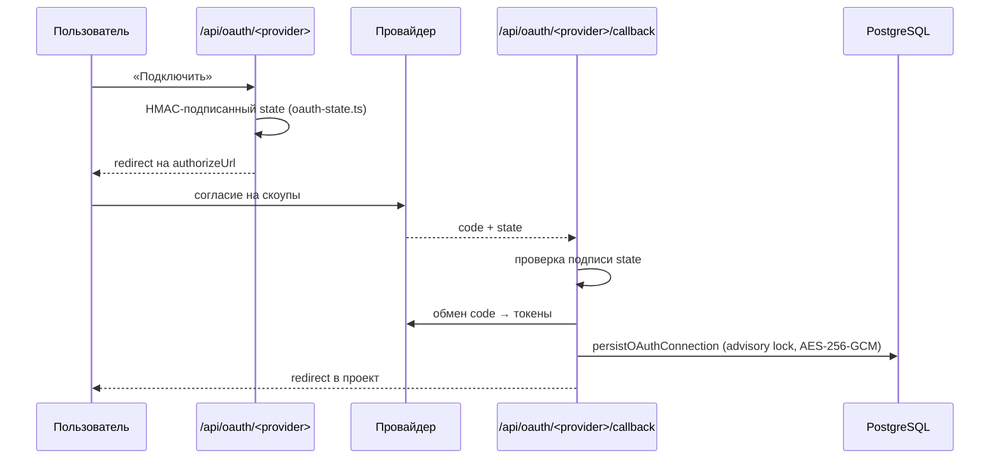

# Поток: подключение внешнего сервиса

Кто: участник проекта. Итог: `ServiceConnection` со статусом `active` и зашифрованным токеном.

## Опорные точки

| Шаг | Файл |
|---|---|
| Старт (статичный authorize URL) | `oauth-start-route.ts` + `ProviderDef.oauthStart` |
| Старт с логикой (google — выбор сабпровайдера, twitter — PKCE) | собственный `route.ts` |
| Подпись состояния | `oauth-state.ts` (ключ `BETTER_AUTH_SECRET`) |
| Колбэк | `oauth-callback-route.ts` + `oauth-callback-config.ts` |
| Сохранение | `oauth-flow.ts` → `persistOAuthConnection` |

## Ветки

- **Google Ads** — после колбэка пользователь выбирает аккаунт на `/projects/[id]/select-ads-account`.
- **LinkedIn** — на колбэке запоминается `metadata.linkedinMemberUrn`, чтобы потом не дёргать `/userinfo`.
- **Google** — email берётся из `id_token`; `/userinfo` только как запасной вариант.
- **`stateProvider` должен совпадать** с `expectedProvider` колбэка; расхождение есть только у meta (роут `meta` → ключ реестра `metaAds`).

## Проверка

Подключение появилось в проекте, статус `active`, токен в БД нечитаем как есть, повторное подключение того же сервиса не плодит вторую запись.
