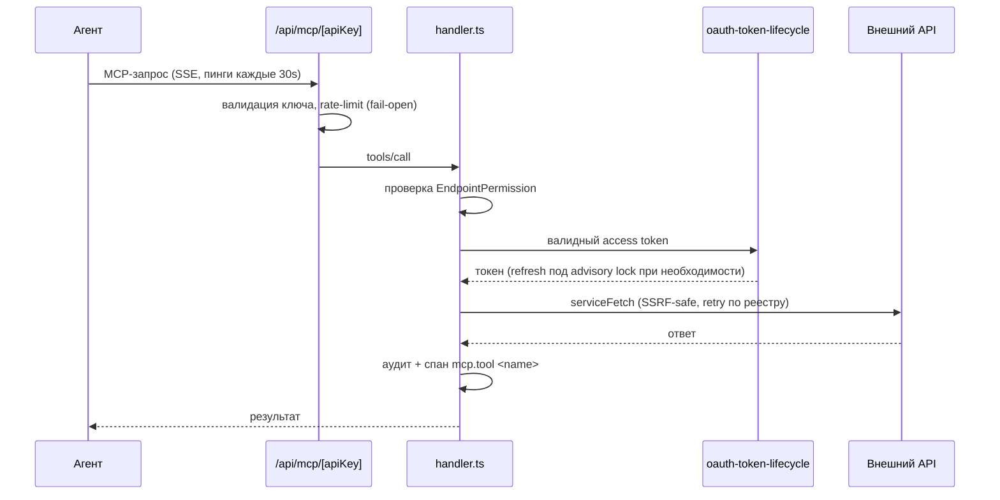

# Поток: вызов инструмента агентом

Кто: AI-агент с ключом `sg_…`. Итог: результат инструмента + запись в аудите.

## Отказы

| Ситуация | Поведение |
|---|---|
| Ключ неизвестен | 401; на IP — лимит 30 запросов/60с против перебора |
| Права нет | Отказ, запись в аудит |
| Инструмент дольше 30с | Таймаут в `handler.ts` |
| Мёртвый токен (permanent) | `revoke` подключения + уведомление «Reconnect required» |
| Сетевой сбой (transient) | Счётчик `consecutiveFailures`; revoke только на 3-м |
| Ошибка БД в rate-limit | Запрос проходит, пишется `mcp.rate_limit_error` |
| Необработанное исключение | `reportMcpRouteError()`: 500, для ошибок БД — 503; стек наружу не уходит |

## Проверка

Вызов разрешённого инструмента возвращает результат и оставляет строку в `AuditLog`; вызов неразрешённого — отказ и тоже строку; в SigNoz виден спан `mcp.tool <name>` и вложенный `service-fetch <provider>`.
